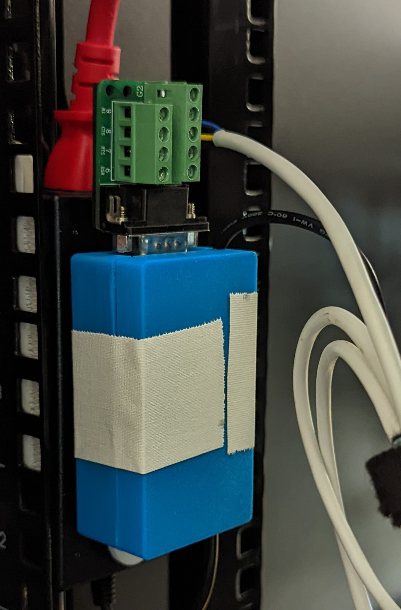
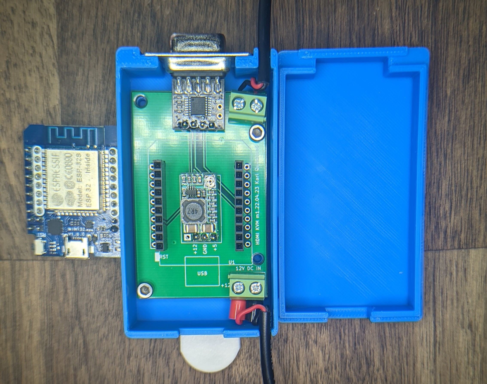

# Hardware

The PCB and case are designed to be 1U in height. This also makes it pretty easy to secure to a basic power brick.
The PCB  can be powered via USB or via 12V DC. I wasn't sure if I was going to power the module off of one of the spare USB ports on the KVM or if I wanted to bundle the controller and main power supply so i could have one cable bundle going towards the KVM. I opted for the latter and decided to secure the enclosure to the power supply.

<!-- markdownlint-disable-next-line MD045 -->

The "DC out" cable leaves the enclosure right next to the DB9 port where the serial and power cables are combined with some cable ties before being routed to the KVM on the front of the rack.

## PCB

If you want to edit the pcb, the KiCad 6 files are included subject to [the license terms](../LICENSE.md).

The ESP32 module comes from [this](https://github.com/r0oland/ESP32_mini_KiCad_Library) library. Thanks to [r0oland](https://github.com/r0oland) for that library!

<!-- markdownlint-disable-next-line MD045 -->

### BOM

The PCB is secured to the enclosure with some 4mm M3 screws I had laying around.
The primary components on the PCB are:

- [D1 Mini style ESP32 chip](https://www.aliexpress.com/item/2251832633593063.html)
- [Configurable DC Buck converter module](https://www.aliexpress.com/item/32833398811.html). This steps the 12V dc from the KVM power supply down to the 5V for the ESP32 module.
- [Ultra Compact RS232 to TTL Converter with Female DB9 (3.3V to 5V)](https://www.amazon.com/gp/product/B00OPTOKI0/)

#### gerber

If you want to make zero changes, the [gerber files are included](./pcb/hdmi-kvm/export/2022.04.23.zip) and are subject to [the license terms](../LICENSE.md).

The gerber files / KiCad project are set up for use with JLCPCB but probably would work as-is with other PCB fab houses, too.

## Enclosure

It's not my best work but it works. I printed with my "fast, not accurate" profile so the snaps that are meant to keep the lid attached to the rest of the body don't work that well; this is the reason for the white tape in the picture.

You should be OK if you print slower but STEP files for both the [PCB](./pcb/hdmi-kvm/hdmi-kvm.step) and [enclosure](./enclosure/kvm-controller-enclosure.step) are included - subject to [the license terms](../LICENSE.md),
