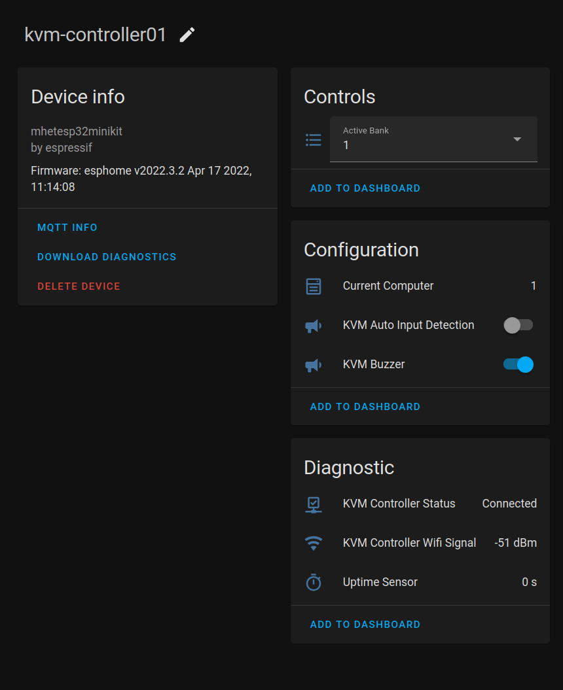

# `uart_kvm` custom component for ESPHome

This custom component allows for basic control over a generic 8:1 HDMI2.0 KVM switch.
Specifically developed for model number [`PX-UHDKVM801-2.0`](https://www.aliexpress.com/item/1005003927404402.html).

Photos of the internals can be found [on my personal site](https://karlquinsland.com/hdmi-kvm-teardown-and-esphome/).

When working, you should get a device page in Home Assistant like this:

<!-- markdownlint-disable-next-line MD045 -->


## Using the component

**Note:** It is possible to get _basic_ control over the KVM without this custom component! ESPHome has _native_ support for _writing_ to a UART. If you only need to tell the KVM what to do then you can use the native [`uart.write`](https://esphome.io/components/uart.html#uart-write-action) call!

However, if  you also want to probe the KVM to get the current active input bank, you will need to _read_ from the UART which can't be done with the native UART component. That's where this custom component comes into play :).

To load this custom component in your ESPHome configuration, you need to use the [`external_components`](https://esphome.io/components/external_components.html) block like so:

```yaml
external_components:
  - source:
      type: git
      url: https://github.com/kquinsland/hdmi-kvm-esphome
    components: [ uart_kvm ]
```

If you have any issues, try to remove the local cache:

<!-- markdownlint-disable-file MD014 -->
```shell
$ rm -rf .esphome/external_components
```

## Example YAML

This is not a _complete_ YAML file for ESPHome but it does illustrate how to use the custom component and to control the KVM directly with `uart.write` for the various functionalities that the custom component does NOT implement:

```yaml
esphome:
  on_boot:
    priority: 600
    then:
      # Buzzer on is helpful for testing and to know when an automation triggers a change
      - switch.turn_on: sw_tmpl_buzzer
      # I do not want the KVM to automatically switch to any new active HDMI cable
      - switch.turn_off: sw_tmpl_auto_input

# See: https://esphome.io/components/external_components.html
# Will be cached in .esphome/external_components/
##
external_components:
  - source:
      type: git
      url: https://github.com/kquinsland/hdmi-kvm-esphome
    components: [ uart_kvm ]

##
# Expose a dropdown/select to the user via HA
# See: https://esphome.io/components/select/template.html
##
select:
  - platform: template
    id: tmpl_sel_active_port
    name: "Active Bank"
    optimistic: false
    # Create one option for each host the KVM is to control
    # You can use any string you like but the `set_active_bank()` requires an `int` so
    #   choose the strings in the select wisely!
    # Create an entry for each input bank you wish to be able to switch between.
    # E.G.: If you only have 5 hosts attached to an 8 bank switch, you can safely
    #   leave options for 6,7,8 off.
    # In testing the KVM silently ignores commands to switch to an input bank beyond
    #   what the switch supports. E.G.: telling an 8 port KVM to make bank 10 active 
    #    does nothing.
    ##
    options:
      - "1"
      - "2"
      - "3"
      - "4"
      - "5"
      - "6"
      - "7"
      - "8"
    set_action:
      then:
        lambda: |-
          // ESPHome/HA use strings in select components. atoi() fixes this for us :)
          int bank = atoi(x.c_str());
          id(kvm1).set_active_bank(bank);
    # We poll the uart to get the current port
    # Note: ESPHome polls get_active_bank() every several seconds. Unless we actively tell ESPHome to
    #   re-run this lambda as soon as the KVM active input bank changes, this value will lag behind reality
    lambda: |-
      int active = id(kvm1).get_active_bank();
      return to_string(active);

# The initial documentation that the seller provided did not define a way to inquire about buzzer active state or active input chase behavior so we can implement this with standard `uart.write` rather than in custom c++
switch:
  - platform: template
    id: sw_tmpl_buzzer
    name: "${friendly_name_short} Buzzer"
    icon: "mdi:bullhorn"
    entity_category: "config"
    device_class: "switch"
    optimistic: True
    # I don't know how to confirm the state of things so we must assume that sending the "off" command will be enough to turn it off. In testing, sending the "off" command is reliable.
    # If this was not the case, then we could change how things work in HA: instead of a switch
    #   the user will see 2 buttons: one for on, the other for off.
    assumed_state: false
    turn_on_action:
        # Note: the KVM does a short chirp to indicate that it is on
      - uart.write: [0xAA, 0xBB, 0x03, 0x02, 0x01, 0xEE]
    turn_off_action:
      - uart.write: [0xAA, 0xBB, 0x03, 0x02, 0x00, 0xEE]

  - platform: template
    id: sw_tmpl_auto_input
    name: "${friendly_name_short} Auto Input Detection"
    icon: "mdi:bullhorn"
    entity_category: "config"
    device_class: "switch"
    optimistic: True
    assumed_state: False
    turn_on_action:
      - uart.write: [0xAA, 0xBB, 0x03, 0x81, 0x01, 0xEE]
    turn_off_action:
      - uart.write: [0xAA, 0xBB, 0x03, 0x81, 0x00, 0xEE]


uart:
  # We want to impersonate the remote/handset by injecting via the HTX pin which is mapped to 17
  tx_pin: GPIO17
  # Likewise, if the motor controller sends anything to the remote, we _also_ want to hear it.
  rx_pin: GPIO16
  # bog standard 9600 8n1
  baud_rate: 9600

# Load up __init.py__
uart_kvm:
    id: kvm1
    active_bank:
      id: kvm1_bank
      name: "Current Computer"
      # We will expose this to HA through the template select above
      internal: false
      on_value:
        then:
          - lambda: |-
              // Tell ESPHome to refresh the value for the select so it does not lag by several seconds
              id(tmpl_sel_active_port).update();

```

### UART + Component

You will need a TTL <-> RS232 adapter hooked up to an ESP module. I have had a lot of trouble with the cheap MAX232 clone dongles on amazon so you absolutely should do basic loopback tests and confirm signal / voltage levels with an oscilloscope if you are having trouble getting this to work!

## PCB and enclosure

Because "scope-creep" is my middle name, I created a simple PCB and enclosure for an ESP32 module and `TTL` <-> `UART` module.
Details on both the PCB and enclosure can be found in the [`hardware`](./hardware/readme.md) folder.
